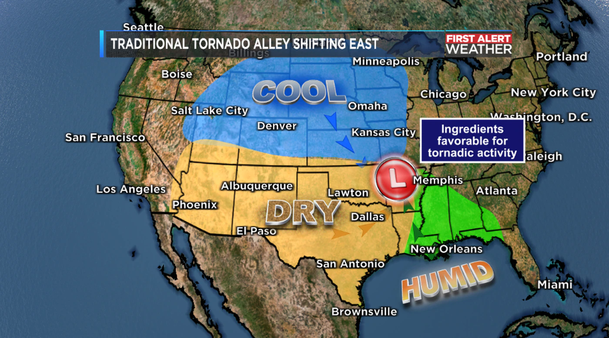
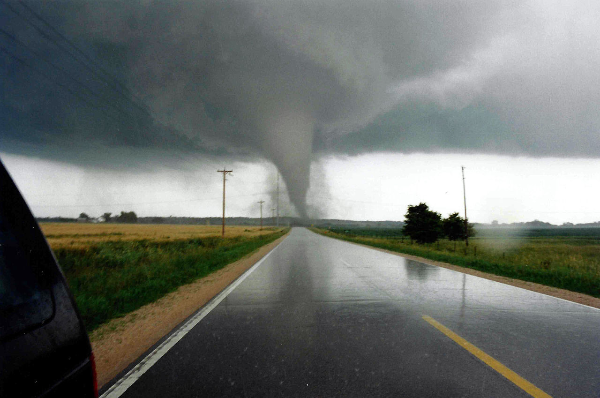
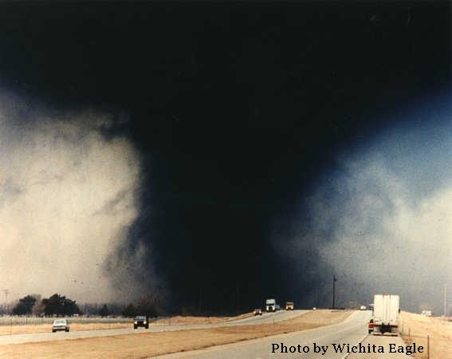
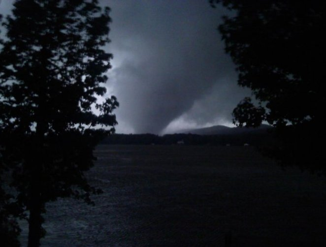
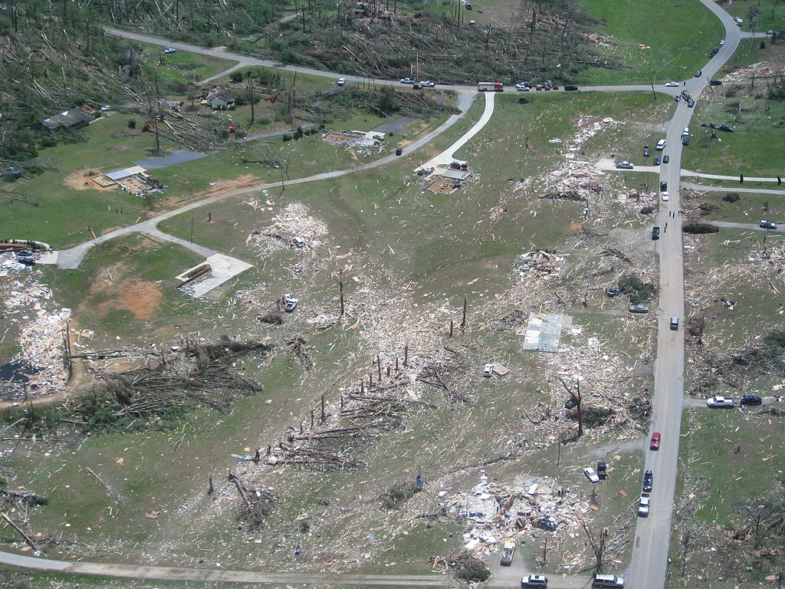
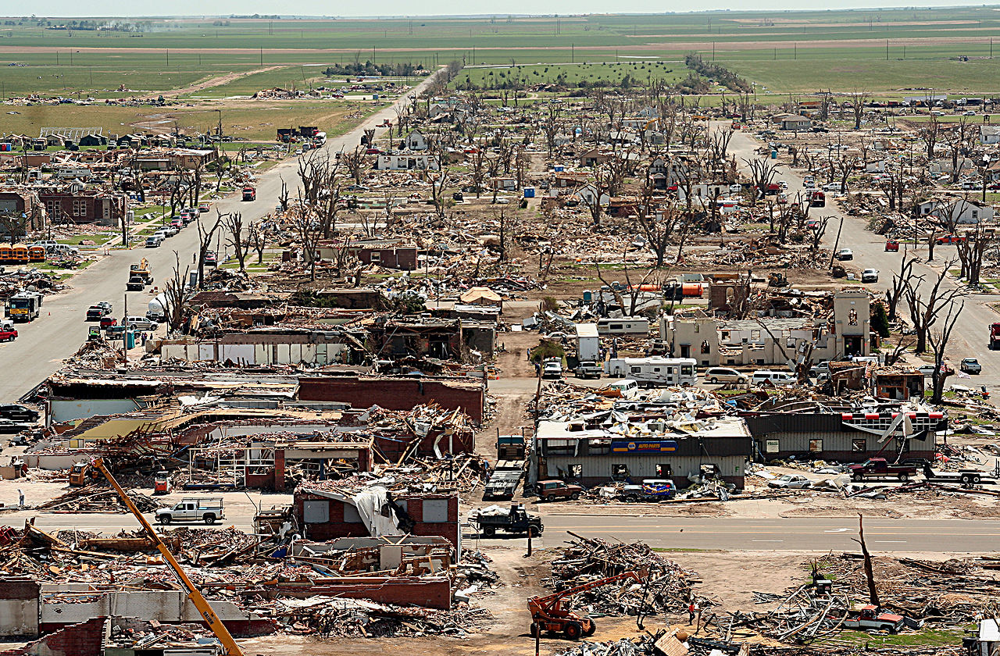
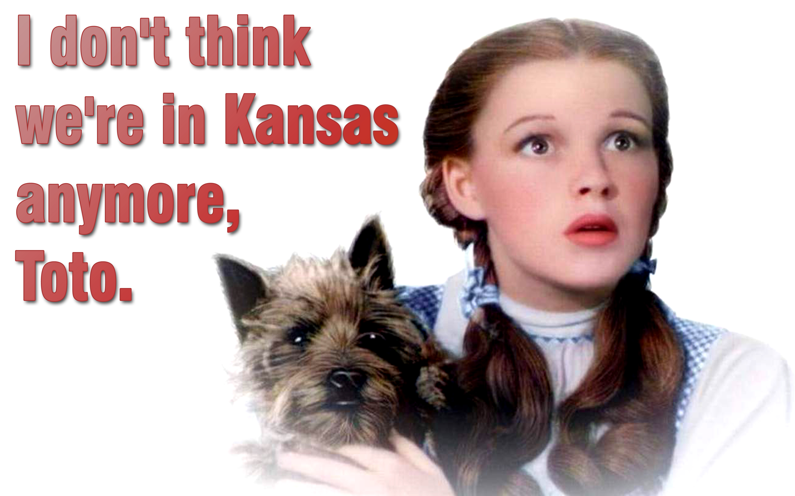

```{r setup, include=FALSE}
knitr::opts_chunk$set(echo = TRUE)
setwd("D:\\RProjects")
library("randtests")
library("forecast")
data <- ts(read.csv(file = "tornadoesMonths1990.csv"), start = 1990, frequency = 12)

HannanRissanen <- function(X, p, q){
  coef <- ar(X, method = "yule-walker")$ar
  n <- length(X)
  m <- length(coef)
  Xhat <- rep(0, n)
  for (i in (m+1):n) {
    Xhat[i] <- coef%*%rev(X[(i-m):(i-1)])
  }
  What <- X-Xhat
  Xmat <- matrix(NA, nrow = n-m-q, ncol = p)
  Wmat <- matrix(NA, nrow = n-m-q, ncol = q)
  for (i in 1:(n-m-q)) {
    Xmat[i,] <- X[(m+q+i-1):(m+q+i-p)]
    Wmat[i,] <- What[(m+q+i-1):(m+i)]
  }
  Z <- cbind(Xmat, Wmat)
  beta <- solve(t(Z)%*%Z, t(Z)%*%X[(m+q+1):n])
  return(list("phi" = beta[1:p], "theta" = beta[(p+1):(p+q)]))
}
getpsi <- function(AR, MA, m){
  n <- max(c(m+1,length(AR),length(MA)))
  phi <- c(AR,rep(0,n-length(AR)))
  theta <- c(MA,rep(0,n-length(MA)))
  psi <- rep(0,n+1)
  for(i in 1:(n+1)){
    if(i==1){
      psi[1] <- theta[1] + phi[1]
    }else{
      psi[i] <- theta[i] + sum(c(psi[(i-1):1],1)*phi[1:i])
    }
  }
  psi <- c(1,psi[1:(length(psi)-1)])
  return(psi[1:(m+1)])
}
myARMAacf <- function(AR, MA, m=50, ACVF = F){
  m1 <- max(100,2*m)
  psi <- getpsi(AR, MA, m1)
  acvf <- rep(0,m1)
  for(h in 1:m1){
    acvf[h] <- sum(psi[1:(m1-h+1)]*psi[h:m1])
  }
  if(ACVF){
    return(acvf[1:m])
  }
  return(acvf[1:m]/acvf[1])
}
innovations <- function(AR, MA, n){
  ACVF <- myARMAacf(AR, MA, m=max(50,2*n), ACVF = T)
  #gamma <- ACVF[2:(n+1)]
  Theta <- matrix(0, ncol=n, nrow=n)
  v <- vector(length=n+1)
  v[1] <- ACVF[1]
  Theta[1,1] <- ACVF[2]/v[1]
  v[2] <- ACVF[1]-Theta[1,1]^2*v[1]
  for(i in 2:n){
    for(k in 0:(i-1)){
      if(i-k+1==(n+1)){
        Theta[i,i-k] <- (ACVF[abs(i-k)+1]-sum(Theta[k,k:2]*Theta[i,i:(i-k)]*v[1:(k+1)]))/v[k+1]  
      }else{
        Theta[i,i-k] <- (ACVF[abs(i-k)+1]-sum(Theta[k,k:1]*Theta[i,i:(i-k+1)]*v[1:k]))/v[k+1]
      }
      
    }
    v[i+1] <- ACVF[1]-sum(Theta[i,i:1]^2*v[1:i])
  }
  list(Theta,v)
}
hStepPred <- function(x, H, AR, MA){
  n <- length(x)
  Theta <- innovations(AR, MA, n+H-1)[[1]]
  xhats <- rep(0,n); xhat_n_hs <- rep(0, H)
  for(i in 2:n){
    xhats[i] <- sum(Theta[i-1,1:(i-1)]*rev(x[1:(i-1)]-xhats[1:(i-1)]))
  }
  for(h in 1:H){
    xhat_n_hs[h] <- sum(Theta[n+h-1,h:(n+h-1)]*rev(x-xhats))
  }
  return(xhat_n_hs)
}
```

## Introduction

I will do a time series analysis on the number of tornadoes that have been recorded each month in the United States since 1990. This data was first officially recorded by the National Oceanic and Atmospheric Administration (NOAA) starting in 1950. At first, I was going to make forecasts using the complete data from 1950, but there are inconsistencies from the earlier data. Over time, the frequency of tornadoes increases. This increase is due to an improvement in technology and recording devices for confirming sightings. Specifically, the widespread implementation of Doppler radar and satellite imaging improved the forecasting and sightings of tornadoes in recent decades. The complete data can be shown in the plot below. I will analyze this time series data and forecast the number of tornadoes in the coming months of 2021. There is already recorded data for April, so I can see if the predictions match the current trend.

```{r, fig.align="center", echo=FALSE}
data2 <- ts(read.csv(file = "tornadoesMonths1950.csv"), start = 1950, frequency = 12)
plot.ts(data2, main = "Monthly Confirmed Tornadoes in the US Since 1950", ylab = "Tornado Count", ylim = c(0, 850))
text(2002.5, 800, labels = "2011 Super Outbreak", cex = 0.5, font = 2)
arrows(2008.5, 800, x1 = 2010.5, y1 = 750, code = 0)
text(1960, 350, labels = "1965 Palm Sunday Outbreak", cex = 0.5, font = 2)
arrows(1962, 325, x1 = 1964.5, y1 = 250, code = 0)
text(1992, 650, labels = "Outbreak Sequence of May 2003 and 2004", cex = 0.5, font = 2)
arrows(1997, 625, x1 = 2002.5, y1 = 500, code = 0)
text(1970, 450, labels = "1974 Super Outbreak", cex = 0.5, font = 2)
arrows(1971, 425, x1 = 1973.95, y1 = 250, code = 0)
```

## Some History and Important Facts

Forecasting the number of tornadoes in the future can give people an idea of potential damages and also help people prepare. However, the number of tornadoes that occur is not always the best predictor of damages and fatalities. The severity of the tornadoes also need to be taken into account. For instance, in 1973 there were 1102 tornadoes recorded with 89 fatalities recorded, whereas in 1974 there was a single tornado outbreak from April 3th to April 4th that killed 307 people. The number of recorded tornadoes in 1974 is 945, 157 less than 1973. A system was implemented in 1973 called the Fujita (F) Scale which took into account the damages and wind speeds of tornadoes. The Fujita Scale ranges from F0 to F5, each indicating the severity of the storm. Ratings are given by looking at the damages left behind in the path of the tornado, with F0 being light damage and F5 being incredible damage. Improvements to the scale were made in 2007 with the Enhanced Fujita (EF) Scale, ranging from EF0 to EF5. With the EF scale and improving technology, the ability to forecast and prepare for tornadoes is getting better each year. Here is a list of [infamous outbreaks](https://weather.com/storms/tornado/news/worst-tornado-outbreaks-20130228) in the United States:

* 1974 Super Outbreak, 148 tornadoes with six F5 ratings, 307 fatalities
* 2011 Super Outbreak, 349 tornadoes with four EF5 ratings, 321 fatalities
* 1965 Palm Sunday Outbreak, 52 tornadoes with 22 F4/F5 ratings, 260 fatalities
* 1992 Houston to Carolinas Outbreak, 105 tornadoes, 26 fatalities
* 1999 Oklahoma City Metro Outbreak, 61 tornadoes, 55 fatalities

and probably the most infamous...

* 1925 Tornado Outbreak with at least 12 confirmed tornadoes including the [Tri-State tornado](https://ejssm.org/ojs/index.php/ejssm/article/view/114/88) which killed 695 people

When the Fujita Scale was introduced, the Techniques Development Unit of the National Severe Storms Forecast Center hired students to read publications and newspaper articles on tornadoes since 1950 and to assign F-scale damage ratings to these storms. This is why storms before 1973 have ratings.

The majority of tornadoes in the United States occur in an area called "Tornado Alley," encompassing the central plain states from Texas to North Dakota. However, in recent years, research (such as [this research](http://nwafiles.nwas.org/digest/papers/2010/Vol34No2/Pg145-Gagan-etal.pdf) and [this research](https://www.nature.com/articles/s41612-018-0048-2)) has indicated that this high frequency area is shifting eastward toward states like Tennessee, Alabama, and Georgia. This area was named "Dixie Alley."

<br>
<br>



<br>
<br>

The problem with this shift is the lack of preparation across Dixie Alley. Most homes across the central plains have storm shelters, tornado alarms, and other measures in place to keep them out of harm's way. However, most homes across Dixie Alley have no measures in place regarding tornado safety.

<br>
<br>

<center>
{width=480px}  {width=400px} <br>
F5 Tornado in Oakfield, Wisconsin, 1996 $\hspace{5cm}$ F5 Tornado in Hesston, Kansas, 1990
</center>

<br>
<br>

## Time Series Analysis

I want to forecast the number of tornadoes that will occur in the coming months of 2021. So far there have been 193 confirmed tornadoes in 2021, with 46 in April. Here is a plot of the complete monthly tornado data since 1990 with some of the outbreaks highlighted.

```{r, fig.align="center"}
plot.ts(data,
        xlab = "Year",
        ylab = "Tornado Count",
        main = "Monthly Confirmed Tornadoes in the US Since 1990",
        ylim = c(0, 850))
text(2006, 800, labels = "2011 Super Outbreak", cex = 0.5, font = 2)
arrows(2009, 790, x1 = 2010.75, y1 = 750, code = 0)
text(2015, 600, labels = "2019 May Outbreak", cex = 0.5, font = 2)
arrows(2017, 575, x1 = 2018.9, y1 = 500, code = 0)
text(1995, 650, labels = "Outbreak Sequence of May 2003 and 2004", cex = 0.5, font = 2)
arrows(1997, 625, x1 = 2002.5, y1 = 500, code = 0)
```

### Removing Trend and Seasonality

Now let's use the decompose() function to obtain the random noise. This function will remove the trend and seasonality.

```{r, fig.align="center"}
trend <- decompose(data)$trend
season <- decompose(data)$seasonal
noise <- decompose(data)$random
noise <- noise[!is.na(noise)]      
trend <- trend[!is.na(trend)]
plot(decompose(data))
```

Highlighted above is each component of the decomposition: observed, trend, seasonal, and random. Tornadoes are seasonal, so we expected a heavy seasonal component. The random component looks stationary with the exception of the one clear outlier. This outlier is the month of April in 2011 where there were five major outbreaks, including the Super Outbreak of 2011 from April 25-28. This month spawned a record 771 confirmed tornadoes! There was a total of four EF5 and 13 EF4 tornadoes, and the estimated total damages were $10.2 billion, the most for an outbreak ever!

<br>
<br>

<center>
{width=400px}  {width=400px} <br>
EF4 Tornado in Shoal Creek Valley, Alabama on April 27, 2011 $\hspace{2cm}$ EF4 Damage in Ringgold, Georgia on April 27, 2011
</center>

<br>
<br>

### Check for Whiteness

I will apply multiple tests from the "randtests" package to test whether the random component is independent.

```{r, fig.align="center"}
Box.test(noise, type="Ljung-Box", lag=20)
turning.point.test(noise)
difference.sign.test(noise)
rank.test(noise)
qqnorm(noise)
qqline(noise)
```

Based on all of the tests, it appears that there is still a trend in the data. I think this is being caused by the major outbreaks, such as the 2011 and 2019 outbreaks. The Ljung-Box test was conclusive that the data is independent, so I will go with that conclusion. We ran into this same problem with the Johnson & Johnson data and Australian Wine data, but did not run into problems so I will continue.

### Create a Model

To choose the number of AR and MA coefficients I will start by analyzing the autocorrelation function (ACF) and the partial autocorrelation function (PACF).

```{r, fig.align="center"}
acf(noise, lag.max = 50)
acf(noise, lag.max = 50, type = "partial")
```

The ACF appears to cut off at lag 6 and the PACF appear to gradually decrease. This is an indication that an MA(6) model is appropriate. However, I will ultimately pick a model by looping through different models and choosing the one with the best AICC.

```{r, warning=FALSE}
iterations <- 6    # maximum order we want to test for each p and q
AICCs <- matrix(NA, nrow = iterations + 1, ncol = iterations + 1)
bestAICC <- Inf
bestOrder <- c()
for (i in 0:iterations) { # loop over p
  for (j in 0:iterations) { # loop over q
    AICC <- arima(noise, order = c(i,0,j), include.mean = F, method = "ML")$aic
    if (AICC < bestAICC){
      bestOrder <- c(i,j) # (p,q)
      bestAICC <- AICC
      print(paste("The optimal number of AR and MA coefficients are", bestOrder[1], "and", bestOrder[2], sep = " "))
    }
    AICCs[i+1,j+1] <- AICC
  }
}
```

I was surprised that the MA(6) was never even considered. From the results, there is an indication that the best model would be an ARMA(`r bestOrder[1]`,`r bestOrder[2]`). Because this model produced the minimum AICC, I will choose this to make my final predictions. Next, I will use the Hannan-Rissanen algorithm to estimate the ARMA coefficients.

```{r}
model <- HannanRissanen(noise, bestOrder[1], bestOrder[2])
phi_hat <- model$phi
theta_hat <- model$theta
model
```

### Make Predictions

The model coefficient can be shown above. Lastly, I will make predictions using the model found in the last step. I will use the Innovations-style h-step forecast to predict the the number of tornadoes in the remaining months of 2021.

```{r, fig.align="center"}
pred2021 <- rep(0, 9)
for (i in 7:15) {
  n <- length(noise)
  xhats <- hStepPred(noise, i, phi_hat, theta_hat)
  fit <- holt(trend, h = i) 
  pred2021[i-6] <- round(fit$mean[i]+season[i-3]+xhats[i])
}
finalPredictions <- as.data.frame(pred2021)
colnames(finalPredictions) <- "Predictions"
rownames(finalPredictions) <- c("Apr", "May", "Jun", "Jul", "Aug", "Sep", "Oct", "Nov", "Dec")
finalPredictions

predTS <- ts(finalPredictions, start = c(2021, 4), frequency = 12)
plotTS <- window(data, start=c(2017,1), end = c(2021,3))
plot(NA, NA,
     xlab = "Year",
     ylab = "Tornado Count",
     xlim = c(2017,2022),
     ylim = c(0, max(as.matrix(plotTS), as.matrix(finalPredictions))),
     main = "Tornadoes in the US from 2017 to 2022")
points(plotTS, type = "l")
points(predTS, type = "p", pch = 25, col = "red")
```

The forecasts look plausible and appear like a typical tornado season. However, with tornado seasons, it is extremely difficult to predict the catastrophic outbreaks.

### Ask Questions

Next, we may ask ourselves what damage should we expect? Or, how many fatalities might there be? I will look back into the past to see what year is most like the forecasted year 2021. I will then look at some statistics from those years to see what we might expect. To find these years, I will use the sum-of-squared-differences to compare with 2021.

```{r, fig.align="center"}
year2021 <- c(data[373:375], finalPredictions[[1]])
diff <- rep(0, floor(length(data)/12))
for (i in 1:floor(length(data)/12)) {
  diff[i] <- sum((data[(i*12-11):(i*12)] - year2021)^2)
}
closestYears <- order(diff)

plot.ts(year2021,
        type = "l",
        xlab = "Month",
        ylab = "Tornado Count",
        main = "2021 vs. 2000 and 2007", col = "black")
lines(data[(closestYears[1]*12-11):(closestYears[1]*12)],
      type = "l",
      col = "red")
lines(data[(closestYears[2]*12-11):(closestYears[2]*12)],
      type = "l",
      col = "blue")
legend(10, 240,
       legend=c("2021", "2000", "2007"),
       col=c("black", "red", "blue"),
       lty=1, cex=0.8, text.font=4,
       title="Year", bg='lightblue')
```

We can see that years 2000 and 2007 are very close to the current trend and forecast of 2021. Let's now take a look at those years for the amount of damage recorded and the number of fatalities.

In the year 2000, there were \$424 million of damages ($652 million adjusted for inflation) and there were 41 fatalities. In the year 2007, there were \$1.4 billion of damages (\$1.8 billion adjusted for inflation) and there were 81 fatalities. These figures are far different than I anticipated. This is an indication that we will not be able to make a good prediction for damages and fatalities. There may or may not be any outbreaks this season, and let's hope not.

Tornado data is particularly difficult to forecast because of these outbreaks. Outbreaks seem to be completely random and follow no pattern. Even though the 2007 tornado season matched the number of tornadoes for 2000, there were some super-outbreaks that caused catastrophic damage. For example, from May 4-6 there was a major tornado outbreak that tore through Texas all the way to South Dakota. The worst tornado that formed in this outbreak was on May 4th. This tornado was rated at an EF5, and destroyed 95% of the entire town of Greensburg, Kansas. This town is still recovering from this natural disaster today. This outbreak from May 4-6 caused $268 million (\$342 million adjusted for inflation) worth of damage, caused 14 fatalities, and spawned a total of 129 confirmed tornadoes.

There is a trend that every year a Fujita Scale is created or changed there is a major outbreak (1974 and 2007), so they should not update it. LOL

<center>
{width=500px}
<br>
Devistation from the EF5 Greensburg, Kansas Tornado
</center>

## Conclusion

The biggest lesson I learned from this project was how difficult is is to predict tornadoes. Although my model did make forecasts that make sense, we still have no idea what is going to happen because of outbreaks. So far, there have been 46 tornadoes recorded in April as of April 26th. My forecast shows there should be `r predTS[1]` tornadoes this month. It could also be the case that not all of the confirmed cases have been filed yet.

```{r, fig.align="center", echo = FALSE}
predTS2 <- ts(finalPredictions, start = c(2021, 4), frequency = 12)
plotTS2 <- window(data, start=c(2021,1), end = c(2021,3))
plot(NA, NA,
     xlab = "Year",
     ylab = "Tornado Count",
     xlim = c(2021,2022),
     ylim = c(0, max(as.matrix(plotTS2), as.matrix(finalPredictions))),
     main = "Tornado Forecasts for 2021")
points(plotTS2, type = "l")
points(predTS2, type = "p", pch = 25, col = "red")
```

To make predictions for this project I took the following steps.

* Removed trend using the decompose() function
* Removed seasonality using the decompose() function
* Checked for whiteness using the following tests:
  + Ljung-Box Test
  + Turning Point Test
  + Difference-Sign Test
  + Rank Test
  + Normal Probability Plot to check for normality
* Used AICC and MLE to choose the number of AR and MA coefficients
* Forecasted the noise using an innovations-style h-step prediction algorithm
* Forecasted the mean using the Holt-Winter algorithm
* Added back in the seasonal component from the decompose() function
* Then get predictions!

The current technology that storm trackers and storm reporters have are keeping people safe across the United States. Statisticians are also keeping people safe by making correct forecast of the weather every day.

<br>
<br>

<center>
{width=500px}
</center>

<br>
<br>
<br>
<br>
<br>

